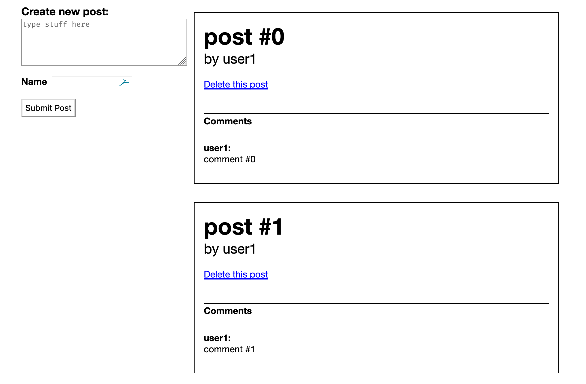

<h1 align="center">
   Take-Home Challenge (Engineering) 
</h1>

<h4 align="center">
  A take-home challenge for an engineering role
</h4>

Please complete the following take-home challenge and submit it to your
recruiter before the deadline.

## Getting Started

* Create a private fork of this repository
* Install Python dependencies in `requirements.txt` or (if you use pipenv)
  `Pipfile.lock`
* You do not need to make changes to the front end, there's no need to install
  the Node dependencies in `react-ui/` (but you're welcome to do so if you
  choose)
* To start the Flask server, follow the [official Quickstart
  instructions](https://flask.palletsprojects.com/en/1.1.x/quickstart/)

## Instructions

The app is a micro-blog, where users can view posts, comments, and create their
own posts. Here's an example of how it might look with some mocked-up data:

The frontend is complete but it doesn't work because it attempts to make XHR
requests to some API endpoints that don't exist.

With Flask, mock a RESTful API for testing purposes. You can do this however
you'd like; the only technology you're required to use is Flask.

You can find the unminified React source code in `react-ui/src`. (We
just symlinked the bundled/minified versions to Flask's default `template/`
and `static/` directory)
